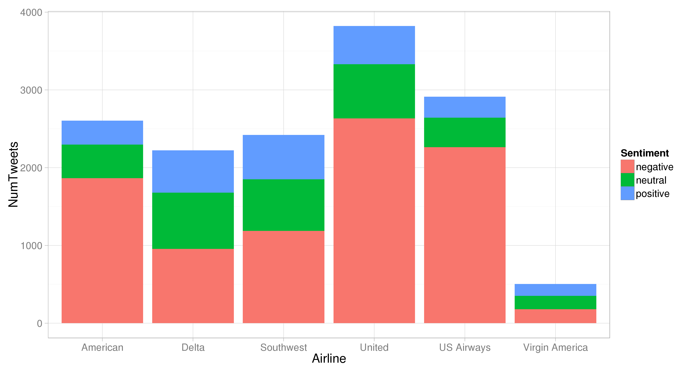

# Assignment 3 - Data Analysis

* Assessment weight: 20% of the total unit assessment.

In this assignment you will provide data analysis within the context of a business application. The specifications below indicate what you need to produce, but not how to produce it. You are free to use any software package, or any programming environment if you wish, to produce the charts of the submission report.

## Topic: Analysis of opinions of airline companies.

We will use the following Kaggle dataset, which contains tweets of people expressing their feelings about several airlines:

* https://www.kaggle.com/crowdflower/twitter-airline-sentiment
* [Offline version](twitter-airline-sentiment.zip)

Each tweet contains the text of the tweet, the airline, and the sentiment expressed (positive, neutral, negative), plus other information that you may find useful. The kaggle webpage also includes some analysis of the data made by several contributors. Look at the "Kernels" tab. The dataset is designed to train predictors of sentiment analysis but we will not do this in the assignment, so many of the contributions will not be relevant to the assignment.

Your task is to produce a report including various charts that address the following questions. Some of the questions will tell you exactly what kind of chart you need to produce, but other questions will only express a need for some information and you need to decide what chart or set of charts would help find the information.

In your report, answer each task using these headings or equivalent:

* **Chart** (or **Charts** when appropriate), where you insert the charts. Make sure that the charts have the appropriate titles and legends. 
* **How the chart(s) was/were produced**, where you explain what software you used, and if appropriate how you used the software to produce the charts. There should be enough information so that the assessor can reproduce the charts.
* **Discussion**, where you explain how the chart(s) can be used to answer the question asked in the task.

## Task 1 (2 marks) - How many tweets per sentiment and airline?

To complete this task, simply reproduce this bar chart. You still need to explain how you produced the chart, and how to read it.

## Task 2 (3 marks) - What are the most common causes of dissatisfaction in each company?

You can use the column "negativereason" of the dataset to answer this question. Make sure that the chart or charts really help to answer the question, and explain how to interpret them.

## Task 3 (5 marks) - What are the most frequent words in negative sentiments?

To complete this task, create a word cloud for each airline company using the tweets expressing negative sentiments about the airline. Write your interpretation of the word clouds.

## Task 4 (5 marks) - What are the most common opinions expressed?

To complete this task, you need to perform topic modelling in order to identify the main topics of the opinions expressed in the tweets. For example, you can perform Latent Dirichlet Allocation as you did in the workshop of week 8. Present the results in the appropriate chart or charts, and write how the charts answer the question of this task. To perform topic modelling you normally need to specify the number of topics. In your report, write how you determined the number of topics. For example, did you try with different numbers of topics and choose the number that reported most satisfactory results? If so, how did you determine the most satisfactory results?

## Task 5 (5 marks) - Provide useful additional information.

This final task is open. Provide additional charts that would help the analyst find additional useful information about the sentiments expressed by the twitters.

## Submission

* Submit your report as a PDF file. The file must include your name and student number.
* Penalty for late submission: 4 marks per day late.
